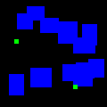

# **motion-planning-net**

This work is based on Motion Planning Neural Network presented in:
https://arxiv.org/abs/1806.05767 \
The goal was to create a Neural Planner for 2D maps.

# **Network structure**

    

The network structure consists of two main parts. An encoder that encodes map images into obstacle space X_obs and the planning network itself.\
The encoder is part of an autoencoder network that has been trained to return input images. Later on planning network, which is a simple feedfroward network, uses encoded images, start position and goal positon to predict next state of an agent.\
During online planning, the paths provided by the Planning Network are simplified and checked for validity. If two consecutive states cannot be connected without encountering an object, then the A* planning algorithm is used to plan a new path between these points.

# **Data**

The coder was trained on a dedicated dataset consisting of generated maps, each with only one solution.

Unlike the coder, only 100 different environments were generated to train the Neural Planner. For each of this environment 4000 diferent starting and goal points were randomly choosen. It gives a total of 400000 path planning problems.

This element is necessary to focus network learning on the path.
Each image has a resolution of 120x120px.

A* algorithm was used for path planning. To minimize the number of turns, special heuristics was implemented.

Unsolved samples:

    
    
    
    
    

Solved samples:

    
    
    
    
    

Before the image was passed to the Encoder, it was reduced in dimensionality to grayscale:

    
    
    

# **Code**

To generate a dataset, first you need to generate maps. To do this, run the generate_maps.ipnb file. Then you have to plan training paths. The next step is to plan the paths for the generated maps. To do so run A_star_path_planning.ipnb.\
Last step is to train the network, for this use the motion_planning_network.ipnb file.

# **Results**

First part was to train encoding part of a network. To do so simple autoencoder model was created, as suggested in the papier. However, due to its simplicity, the output results were quite bad.

    
    
    

To improve them, the ResUNet model structure was implemented with residual layers and shortcut connections. After this operation, the results returned by the encoder are identical to the input ones, but the output vector of the encoder is larger.

The biggest problem encountered was that the network returning the same result regardless of the map. The cause of this problem was teaching the model with one solution for one map, making the network learn the wrong thing.
Instead of learning how to predict the points on the map for a given starting point and target, the model learned how to predict the best point on the map (with the least loss) based on the map rather than the points that should be connected.
The light gray points represent the starting point and goal point, and the dark gray points represent the predicted point.

    
    
    

The solution to this problem is to generate more paths for a given map so that the network focuses on changing start and goal points rather than the map.
