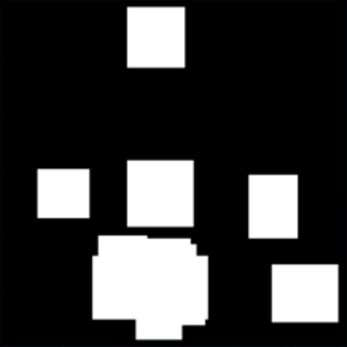
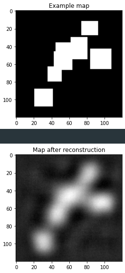
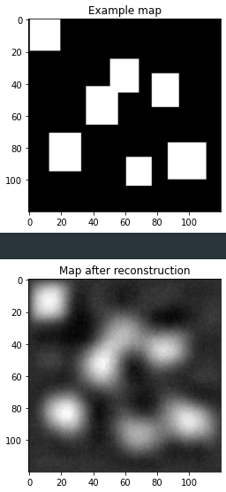
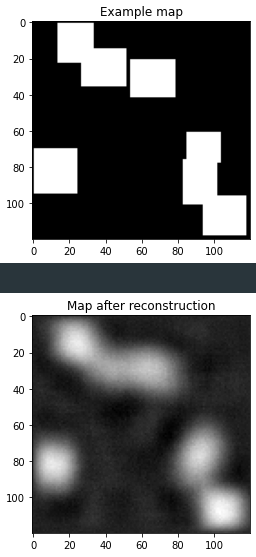
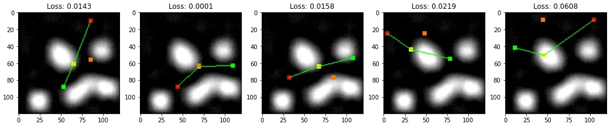

# **motion-planning-net**

This work is based on Motion Planning Neural Network presented in:
https://arxiv.org/abs/1806.05767 \
The goal was to create a Neural Planner for 2D maps.

# **Network structure**

<p align="center">
    
</p>

The network structure consists of two main parts. An encoder that encodes map images into obstacle space X_obs and the planning network itself.\
The encoder is part of an autoencoder network that has been trained to return input images. Later on planning network, which is a simple feedfroward network, uses encoded images, start position and goal positon to predict next state of an agent.\
During online planning, the paths provided by the Planning Network are simplified and checked for validity. If two consecutive states cannot be connected without encountering an object, then the A* planning algorithm is used to plan a new path between these points.

# **Data**

The coder was trained on a dedicated dataset consisting of generated maps, each with only one solution.

Unlike the encoder, only 100 different environments were generated to train the Neural Planner. For each of this environment 100 diferent starting and goal points were randomly choosen. It gives a total of 10000 path planning problems.
This element is necessary to focus network learning on the path.
Each image has a resolution of 120x120px.

A* algorithm was used for path planning. Points on turns were determined from the generated paths and saved in separate JSON files. To minimize the number of points on the turns, a special heuristic has been implemented.

Unsolved samples:
<p align="center">
    
    
    
    
    
</p>

Solved samples:
<p align="center">
    
    
    
    
    
</p>

Maps reduced to grayscale, before passing to encoder:

<p align="center">
    
    
    
</p>

# **Usage**

To generate a dataset, first you need to generate maps. To do this, run the **generate_maps.ipnb** file. \
Inside this file you must specify maps count with corresponding solutions count. You can also specify starting map number if there is need for adding new maps to existing dataset.

``` python
data_settings = {
    'encoder': (0, 10000, 1),
    'train': (0, 10, 100),
    'valid_unknown': (0, 10, 20),
    'test_unknown':  (0, 10, 20),
    'valid_known': (100),
    'test_known':  (100)
}
```

The next step is to plan the paths for the generated maps. To do so run **A_star_path_planning.ipnb** file. \
Last step is to train the network, for this use the **motion_planning_network.ipnb** file.

# **Results**

## **Encoder**

As described in the paper [1], the maps need to be encoded, and a simple autoencoder was created for this purpose. The image representation in the latient space is a tensor of size 32. \
The results are presented below:

<p align="center">
    
    
    
</p>

## **Motion Planning Network**

The main network has been trained to predict only one point at a time. To plan a full path, it must be called iteratively.
At this time, the network is still in the training and tuning stage. \
Latest results:

<p align="center">  </p>
<p align="center">  </p>
<p align="center">  </p>

**Color of point** | **Definition**
--- | ---
Green | starting point
Red | goal point
Orange | oryginal point
Yellow (connected with the lines) | predicted point

# **References**

[1] [Qureshi, Ahmed H. and Simeonov, Anthony and Bency, Mayur J. and Yip, Michael C. Motion Planning Networks. arXiv preprint arXiv:1806.05767, 2018](https://arxiv.org/pdf/1706.04599.pdf)
